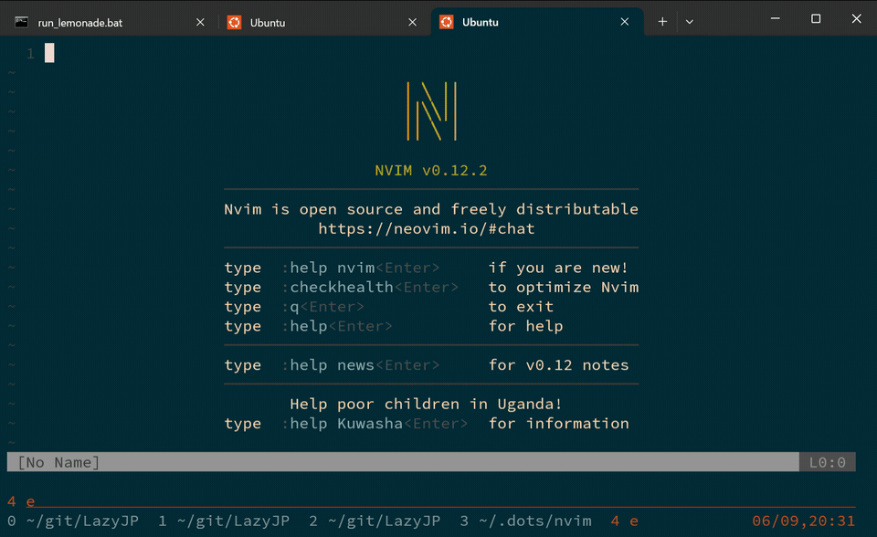

# LazyJP.nvim

日本語入力エンジン。ローマ字のまま書き続けると、AI が文脈を読んで非同期に日本語へ変換する。



## 特徴

- ローマ字（または英語または拼音混在可）でタイプし続ける
- `Ctrl+j` でトリガー：現在行をバックグラウンドでエンジンに送信 → 改行して次の入力を継続
- 変換結果が返ってきたら自動的にローマ字行が日本語に置き換わる
- その間もユーザーは次の行をタイプし続けられる

## インストール

### Neovim プラグイン

```bash
git clone https://github.com/cympfh/LazyJP ~/.local/share/nvim/site/pack/lazyjp/start/LazyJP
```

`init.lua` に設定を追加：

```lua
require("lazyjp").setup({
  style = "casual",
  languages = { "ja", "en", "zh" },
})
```

### Neovim プラグイン（lazy.nvim）

[lazy.nvim](https://github.com/folke/lazy.nvim) を使っている場合：

```lua
{
  "cympfh/LazyJP",
  config = function()
    require("lazyjp").setup({
      style = "casual",     -- casual / formal
      languages = { "ja", "en", "zh" },
    })
  end,
}
```

### キーマップのカスタマイズ

デフォルトのトリガーは `Ctrl+j`（Insert モード）。変更したい場合：

```lua
require("lazyjp").setup({})
vim.keymap.set("i", "<C-j>", function()
  require("lazyjp").trigger()
end)
```

## 動作の詳細

1. Insert モードで `Ctrl+j` を押す
2. 現在行が空 → 通常の改行のみ
3. 現在行に内容あり → バックグラウンドで変換を開始 + 改行挿入
4. 変換結果が返ってきたら行が未編集であればローマ字行を日本語に置き換え
5. 行を編集した場合 → 変換はキャンセルされ、ローマ字のまま残る

コンテキストとして直前2つの変換済み結果が自動で渡されるため、文章の流れを維持した変換が行われる。
